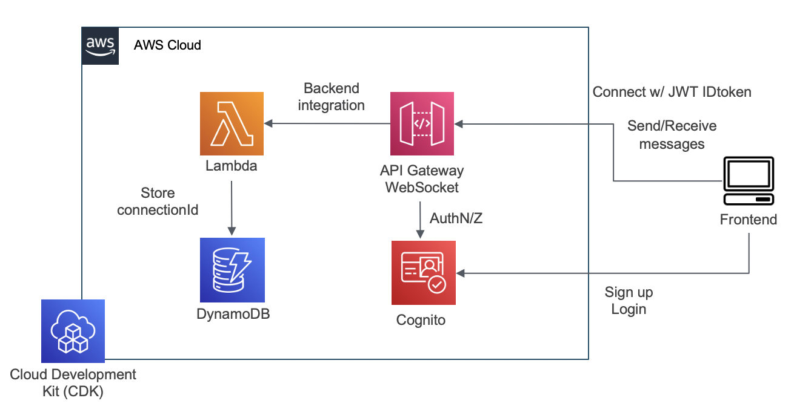

# WebSocket API Cognito Auth Sample
[](https://github.com/aws-samples/websocket-api-cognito-auth-sample/actions/workflows/build.yml)

This sample demonstrates how to integrate Cognito authentication with Amazon API Gateway WebSocket API.

It includes the Lambda implementations for Lambda Authorizer and API Gateway Lambda proxy, AWS Cloud Development Kit (CDK) code to deploy backend infrastructure, and React frontend implementation for demonstration purposes. 

## Architecture
This sample contains the least and simplest set of implementations to achieve Cognito JWT authentication and authorization for WebSocket API. Please refer to [implementation](#implementation) section for the details.



When you integrate this architecture with other system, you can use the pairs of Cognito user ID and WebSocket Connection ID which is stored on the DynamoDB table.

## Deploy
**Prerequisites**: You need the following tools to deploy this sample:

* [Node.js](https://nodejs.org/en/download/) (>= v16)
* [Docker](https://docs.docker.com/get-docker/)
* [AWS CLI](https://docs.aws.amazon.com/cli/latest/userguide/getting-started-install.html) and a configured IAM profile

Then run the following commands:

```sh
cd backend
npm ci
cd ../cdk
npm ci
npx cdk bootstrap
npx cdk deploy
```

Initial deployment usually takes about 10 minutes. After a successful deployment, you will get a CLI output like the below:

```sh
Outputs:
BackendStack.region = ap-northeast-1
BackendStack.userPoolId = ap-northeast-1_xxxxxxx
BackendStack.userPoolWebClientId = xxxxxxxxxxxxxxxxxxxxxxxxxx
BackendStack.webSocketEndpoint = wss://xxxxxxxxx.execute-api.ap-northeast-1.amazonaws.com/prod
```

You can use those values to configure the frontend app next. Please create `.env.local` file by running the following command:

```sh
cd frontend
cp .env.sample .env.local
```

and then fill all the required values in the file by referring to the stack outputs.

Finally, run the below commands to start the frontend server locally:

```sh
cd frontend
npm ci
npm run dev
```

You can now open the browser and go to `http://localhost:3000` to try the working demo.

## Implementation
### Infrastructure as Code
Our CDK code deploy the following resources:

* API Gateway WebSocket API
* Two Lambda functions
    * WebSocket API integration
    * Lambda Authorizer
* Cognito UserPool and UserPoolClient
* DynamoDB Table
    * A table to store the association between Cognito User ID and WebSocket connection ID

All the code is located at `cdk` directory.

### Backend
Our backend consists of two Lambda functions (at `backend` directory):

1. `authorizer`
2. `websocket`

`Authorizer` is [a Lambda authorizer for WebSocket API](https://docs.aws.amazon.com/apigateway/latest/developerguide/apigateway-websocket-api-lambda-auth.html) written in TypeScript. This handler runs in the following steps:

1. Get a JWT from the request query string
2. Verify the token by [aws-jwt-verify library](https://github.com/awslabs/aws-jwt-verify)

You can also refer to [Verifying a JSON Web Token](https://docs.aws.amazon.com/cognito/latest/developerguide/amazon-cognito-user-pools-using-tokens-verifying-a-jwt.html) for more details.

`Websocket` is a WebSocket API Lambda proxy integration written in TypeScript. This handler runs differently according to the request route:

1. `$connect` route
    * Save the pair of Cognito User ID and WebSocket connection ID to the DynamoDB table
2. `$disconnect` route
    * Delete the WebSocket connection ID from the Dynamo table
3. `$default` route
    * Receive the message and just send it back as-is to the same WebSocket connection

You can utilize the information stored on the DynamoDB table. For example you can send notification to a particular Cognito user from other services if they have established WebSocket connection. For more details, you can refer to [Use @connections commands in your backend service
](https://docs.aws.amazon.com/apigateway/latest/developerguide/apigateway-how-to-call-websocket-api-connections.html).

### Frontend
Our frontend is a single page application using React.
The main component is located at[`src/components/echo.tsx`](frontend/src/components/echo.tsx).

For authentication, we add an ID token of Cognito UserPool to request query string. There are several ways to implement WebSocket API authentication and trade-offs among them. You can refer to [this issue comment](https://github.com/aws-samples/websocket-api-cognito-auth-sample/issues/15#issuecomment-1173401338) for more details.

## Clean up
To avoid incurring future charges, clean up the resources you created.

You can remove all the AWS resources deployed by this sample running the following command:

```sh
npx cdk destroy --force
```

## Security

See [CONTRIBUTING](CONTRIBUTING.md#security-issue-notifications) for more information.

## License

This library is licensed under the MIT-0 License. See the LICENSE file.
